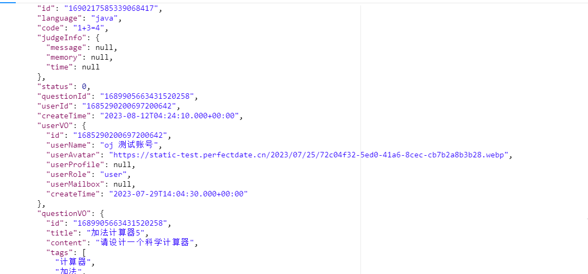

# Gata OJ 在线判题系统
> 来判断用户的提交结果是否正确,用户可以选择题目，在线做题，编写代码并且提交代码;系统会对用户提交的代码，根据我们出题人设置的答案
## 任务进度
1. 题目表和提交表的基础增删改查已开发完毕 23.08.12 

## 知识点记录
突然想明白一件事,持久化层的数据是最终确认的但是在之前可以有好多操作,对数据的处理才是程序员要做的事
重新认识了下包装类

## 业务文档
流程图

## 变更位置
作用单挑提交信息完善,可以做卡片效果原列展示一条信息,移入鼠标弹出做题人信息卡片点击进入做题人主页,方便后期移入个人主页功能
1. 扩展点,可以查看他人总做题信息,弄个天体榜单啥的,最起码我做了题多,你点进来我能装逼一下配合评论功能能做一定社交

## 脑瘫 bug 
> 写代码时候烦的错误和一些写代码时的思考和实践可以当个乐子看别学我
1. 0003 if 条件判断永真

## 23.08.16
预开发代码沙箱,判题逻辑架构构建
> 1. 开发代码沙箱, 通过指定接口,通过实现接口的方式实现不同代码沙箱切换,解耦方便扩展
> 2. 建造工厂模式,实现不同代码沙箱的切换,更改为配置文件可传递配置实现代码沙箱切换
> 3. 
